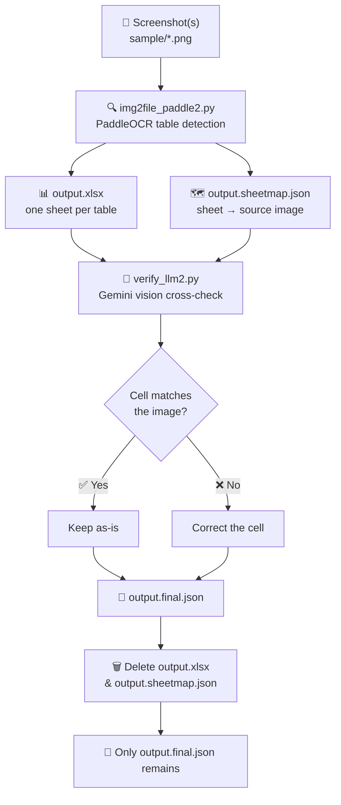

<div align="center">

# 🖼️ Screenshot → Excel → LLM-Verified

### *From a messy screenshot to a clean, cross-checked spreadsheet — automatically.*


</div>

---

## 📌 Project Name & Purpose

**Project:** `img2file_paddle2.py` + `verify_llm2.py`

**Got a screenshot of a spreadsheet and no way to get the actual data out of it?** This two-stage pipeline turns any screenshot (or folder of screenshots) into a clean, structured dataset:

1. **Stage 1 — OCR extraction.** PaddleOCR detects table structure and reads every cell.
2. **Stage 2 — LLM cross-check.** Gemini re-examines the *original image* against the OCR output, cell by cell, and fixes anything it clearly misread.

The final result is a **single corrected JSON file** — no leftover spreadsheets, no manual proofreading. ✅

---

## 🗺️ Overview

| | |
|---|---|
| 🐍 **Language** | Python 3.9+ |
| 📦 **Core dependencies** | `paddlepaddle`, `paddleocr`, `img2table`, `openpyxl`, `google-genai` |
| 💻 **Platform** | Windows, macOS, Linux |
| 🖥️ **Interface** | Command-line, two scripts |
| 📥 **Input** | Screenshot(s) — `.png`, `.jpg`, `.jpeg`, `.bmp`, `.tif`, `.tiff`, `.webp` |
| 📤 **Final output** | One corrected `.json` file (all intermediates auto-deleted) |
| 🧠 **Verification model** | Gemini (vision) — cross-checks OCR output against the original image |
| ⏱️ **Setup time** | ~10 minutes |

---

## 🤔 What Does It Do?

**Think of it as OCR with a second pair of eyes.** OCR is fast but occasionally misreads a digit, drops a decimal point, or garbles a word. Rather than trusting that blindly, this pipeline sends the *original screenshot* back to an LLM alongside the OCR output and asks: *"Does this actually match the image?"* Only cells that are visibly wrong get corrected — nothing is invented.

- 📸 **Your screenshots** — one image, several images, or a whole folder
- 🔎 **Stage 1** — PaddleOCR detects the table(s) and extracts every cell into a spreadsheet
- 🧠 **Stage 2** — Gemini vision re-checks every cell against the image and corrects OCR errors
- 🧹 **Cleanup** — the intermediate `.xlsx` and mapping file are deleted, leaving only the final JSON

---

## ✨ How It Works



---

## ⚡ Quick Start

### 🛠️ Prerequisites

<details>
<summary><strong>🍎 macOS / 🐧 Linux</strong></summary>

```bash
python3 --version   # should print Python 3.9 or higher
pip3 --version
git --version
```

</details>

<details>
<summary><strong>🪟 Windows</strong></summary>

```powershell
python --version    # should print Python 3.9 or higher
pip --version
git --version
```

> 🔎 If `python` isn't recognized, try `py --version` instead, or reinstall Python from [python.org](https://www.python.org/downloads/) and check **"Add Python to PATH"** during setup.

</details>

👉 Don't have Python? Get it from [python.org](https://www.python.org/downloads/)
👉 Don't have Git? Get it from [git-scm.com](https://git-scm.com/downloads)

---

## 🚀 Installation

### Step 1 — Get the project files

```bash
git clone https://github.com/ayush7-hash/OCRproject.git
cd OCRproject
```

### Step 2 — Create a virtual environment *(recommended)*

<details>
<summary><strong>🍎 macOS / 🐧 Linux</strong></summary>

```bash
python3 -m venv .venv
source .venv/bin/activate
```

</details>

<details>
<summary><strong>🪟 Windows (PowerShell)</strong></summary>

```powershell
python -m venv .venv
.venv\Scripts\Activate.ps1
```

> ⚠️ If you get an "execution policy" error, run PowerShell as Administrator and execute:
> `Set-ExecutionPolicy -ExecutionPolicy RemoteSigned -Scope CurrentUser`

</details>

<details>
<summary><strong>🪟 Windows (Command Prompt)</strong></summary>

```cmd
python -m venv .venv
.venv\Scripts\activate.bat
```

</details>

### Step 3 — Install dependencies

<details>
<summary><strong>🍎 macOS / 🐧 Linux</strong></summary>

```bash
pip3 install paddlepaddle paddleocr img2table openpyxl pillow numpy google-genai
```

</details>

<details>
<summary><strong>🪟 Windows</strong></summary>

```powershell
pip install paddlepaddle paddleocr img2table openpyxl pillow numpy google-genai
```

</details>

> 📦 First run will also download PaddleOCR's model files automatically (cached afterward, so subsequent runs are faster).

### Step 4 — Set your Gemini API key

The verification stage needs a `GEMINI_API_KEY` environment variable. Get a key from [Google AI Studio](https://aistudio.google.com/apikey), then:

<details>
<summary><strong>🍎 macOS / 🐧 Linux (bash/zsh)</strong></summary>

```bash
export GEMINI_API_KEY="your-key-here"
```
> 💡 Add this line to your `~/.zshrc` or `~/.bashrc` to avoid re-typing it every session.

</details>

<details>
<summary><strong>🪟 Windows (PowerShell)</strong></summary>

```powershell
$env:GEMINI_API_KEY="your-key-here"
```
> 💡 For a permanent setting, use `setx GEMINI_API_KEY "your-key-here"` and restart your terminal.

</details>

<details>
<summary><strong>🪟 Windows (Command Prompt)</strong></summary>

```cmd
set GEMINI_API_KEY=your-key-here
```

</details>

---

## 🎯 Usage

The pipeline runs in **two steps**. Run Stage 1 first, then feed its output into Stage 2.

### Stage 1 — OCR extraction

<details>
<summary><strong>🍎 macOS / 🐧 Linux</strong></summary>

```bash
python3 img2file_paddle2.py sample/ -o output.xlsx
```

</details>

<details>
<summary><strong>🪟 Windows</strong></summary>

```powershell
python img2file_paddle2.py sample/ -o output.xlsx
```

</details>

This produces:
- `output.xlsx` — one sheet per detected table
- `output.sheetmap.json` — maps each sheet back to its source screenshot

### Stage 2 — LLM verification

<details>
<summary><strong>🍎 macOS / 🐧 Linux</strong></summary>

```bash
python3 verify_llm2.py output.xlsx
```

</details>

<details>
<summary><strong>🪟 Windows</strong></summary>

```powershell
python verify_llm2.py output.xlsx
```

</details>

This cross-checks every cell against the original screenshots and writes **`output.final.json`** — then deletes `output.xlsx` and `output.sheetmap.json`. **Only the final JSON remains.**

---

### 🎛️ Stage 1 Options — `img2file_paddle2.py`

| Argument | Required | Default | Description |
|---|---|---|---|
| `inputs` | ✅ Yes | — | Image file(s) or a folder of screenshots |
| `-o`, `--output` | ✅ Yes | — | Output `.xlsx` path |
| `--lang` | ❌ No | `en` | PaddleOCR language code (single language only) |
| `--min-confidence` | ❌ No | `50` | Minimum table-detection confidence, 0–100 |

### 🎛️ Stage 2 Options — `verify_llm2.py`

| Argument | Required | Default | Description |
|---|---|---|---|
| `xlsx` | ✅ Yes | — | Path to the `.xlsx` produced by Stage 1 |
| `--sheetmap` | ❌ No | `<xlsx>.sheetmap.json` | Path to the sidecar sheet map, if moved |
| `--model` | ❌ No | `gemini-2.5-flash` | Gemini model used for verification |
| `--output` | ❌ No | `<xlsx>.final.json` | Path for the final corrected JSON |
| `--keep-intermediate` | ❌ No | Off | Keep the `.xlsx` and `.sheetmap.json` instead of deleting them |

---

## 🧠 What the Verifier Actually Checks

**This is the second pair of eyes.** For every sheet, the original screenshot is sent back to Gemini alongside the OCR'd data, and it's asked to catch things like:

| OCR Error Type | Example |
|---|---|
| Digit misreads | `0` ↔ `O`, `1` ↔ `l`/`I`, `5` ↔ `S`, `8` ↔ `B` |
| Decimal/comma slips | `1,234.50` misread as `1234.5O` |
| Merged or split words | `"NewYork"` vs `"New York"` |
| Stray whitespace | `"Total "` vs `"Total"` |
| Wrong case | `"total"` vs `"Total"` |

> 🔒 The model is explicitly instructed **not** to invent or "improve" data — only to fix what's visibly wrong in the image. Row/column counts are validated before any correction is applied; mismatches are logged and that sheet is left untouched rather than risking corrupted data.

---

## ⚠️ Common Errors & Fixes

| Error | Cause | Fix |
|---|---|---|
| `command not found: python` | macOS/Linux uses `python3` | Use `python3` instead |
| `command not found: pip` | macOS/Linux uses `pip3` | Use `pip3` instead |
| `ModuleNotFoundError: No module named 'paddleocr'` | Dependencies not installed | Re-run the Step 3 install command |
| `sheet map not found at ...sheetmap.json` | Stage 2 run without Stage 1's output, or file moved | Run Stage 1 first, or pass `--sheetmap` explicitly |
| `ERROR: no tables detected in any input image` | PaddleOCR couldn't find a table | Check image quality/orientation, or lower `--min-confidence` |
| Gemini `429` / `503` errors | Rate limit or temporary overload | The script retries automatically with backoff — just let it run |
| `response was truncated (hit MAX_TOKENS)` | Sheet too large for one request | Increase `MAX_TOKENS` in `verify_llm2.py`, or split the sheet |
| `row count mismatch` warning | Model returned malformed JSON | That sheet is left uncorrected automatically — safe by design |
| `GEMINI_API_KEY` not set | Environment variable missing | Set it per the Step 4 instructions above for your OS |

---

## 📄 License

**MIT** — free to use, modify, and distribute. See [`LICENSE`](LICENSE) for full terms.

---

<div align="center">

**Built with 🐍 Python · 🔍 PaddleOCR · 🧠 Gemini Vision**

*Got a question or found a bug? Open an issue — we don't bite.* 😄

</div>
